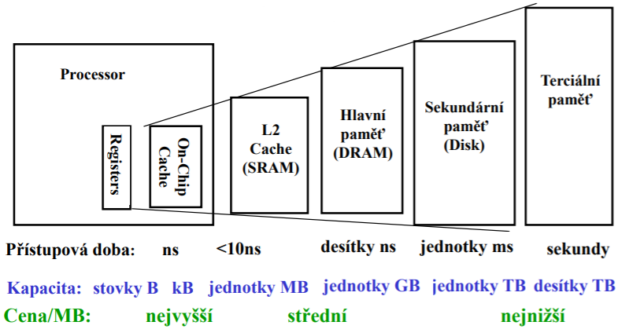
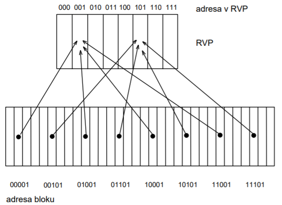
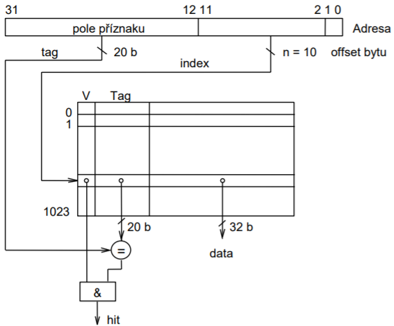
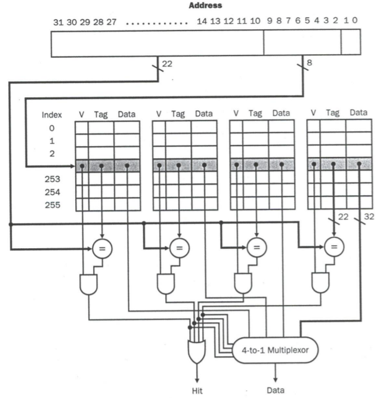

# Paměťová hierarchie
Existují různé druhy pamětí s různými parametry _přístupové doby_, _kapacity_ a _ceny za MB_. Obecně platí, že čím menší přístupová doba, tím menší kapacita a větší cena za MB. Pro maximalizaci výkonnu počítače a snížení ceny proto používáme různé druhy pamětí s různými účely. Proto vzniká paměťová hierarchie.

Paměťová hierarchie má smysly díky dvou principům:
- __Časová lokalita__ - pokud procesor používá nějakou položku v paměti, je vysoká pravděpodobnost, že ji bude používat znovu -> má smysl ji uložit blízko k procesoru, aby k ní byl rychlý přístup.
- __Prostorová lokalita__ - pokud procesor pracuje s nějakou položkou v paměti, potom je vysoká pravděpodobnost, že se bude pracovat i s položkami uloženými v blízkosti této položky -> má smysl uložit celý blok paměti co nejblíž k procesoru.

Paměti se v počítačích používají v těchto funkcích:
- __Vnitřní paměť procesoru__ - registry, registrové sady, zásobníky, fronty, tabulky a paměť mikroprogramů v řadiči procesoru
- __Hlavní paměť__ včetně rychlých __vyrovnávacích pamětí__
- __Vnější paměti__

Dále se budeme zabívat pouze druhy __hlavních__ a __vyrovnávacích__ pamětí.

# Rychlá vyrovnávací pamět
Rychlá vyrovnávací paměť je rozdělena do bloků o konstatní velikosti. Velikost bloků je většinou podle velikosti dat dodávaných z hlavní paměti při blokovém přenosu. Hlavní paměť je rozdělena na bloky stejné velikosti. Bloků v hlavní paměti je ale mnohem výce než ve vyrovnávací paměti, tudíž ne všechny bloky hlavní paměti mohou být uloženy v RVP. Existují mechanismy, které umožňují do RVP nahrát potřebné bloky a nepotřebné bloky z ní odstraňovat.

Základní údaj, který nás zajímá o rychlé vyrovnávací paměti, je __účinnost__. Účinnost RVP představuje pravděpodobnost nalezení bloku p_hit (hit rate) nebo pravděpodobnost nenalezení bloku (miss rate).

Z časového hlediska nás zajímá __přístupová doba__, v případě že blok se v RVP nachází, a __ztrátová doba__ (miss penalty), v případě že blok s v RVP nenachází. Ztrátová doba je doba potřebná k přesunutí bloku z hlavní paměti do RVP a přípaným uvolněním místa v RVP.

## 1. Žádná rychlá vyrovnávací paměť
TODO: Text

TODO: Obrázek návrhu v aplikaci

## 2. Rychlá vyrovnávací pamět s přímým mapováním
Rychlá vyrovnávací paměť má _X_ blokových rámců s určitými _xb_ adresami. Hlavní paměť má _Y_ blokových rámců, kde _Y > Y_, s určitými _yb_ adresami. Adresa polohy bloku v RVP se určí podle nejnižších _x_ bitů adresy v hlavní paměti.

Tudíž: adresa v RVP = adresa bloku _mod_ počet bloků v RVP.

Hodnocení:
- Výhody: jednoduchý koncept.
- Nevýhody: dva bloky se stejnou adresou v RVP, nemohou být současně v RVP.

V RVP je nutné poskytnout informaci, zda je požadovaný blok přítomen a zda je informace v bloku platná. K tomu nám slouží __adresový příznak__ (tag), který je tvořen zbývajícími horními bity adresy bloku, a __příznak platnosti__ (valid bit).

TODO: Obrazek návrhu v aplikaci

## 3. Více-cestná rychlá vyrovnávací paměť
Problém vzájemného vytlačování položek se stejným ukazatelem v RBP se řeší zvýšením stupně asociativity. Podle počtu cest může být v RVP uloženy současně více položek se stejným ukazatelem. Stupeň asociativity lze zvyšovat, dokud se nedospěje k _plně asociativní paměti_, kde je v příznaku celá adresa.

### 3.1 2-cestná rychlá vyrovnávací paměť
TODO

### 3.2 4-cestná rychlá vyrovnávací paměť
TODO

## 4. Plně asociativní rychlá vyrovnávací paměť
TODO

## Koherence data
Změní-li se data v RVP bloku zápisem, ztratí bloky na vzdálenějších urovních platnost. Vzniká tak datová nekonzistence - __nekoherence__. Pro udržování koherence dat ve všech kopiích bloků se používají následující strategie:
- __Přímý zápis__ (write-through) - Při zápisu do RVP se okmažitě zapisuje i do bloku hlavní paměti. Tato strategie je snadná na realizaci a má nízké paměti při R-neúspěchu. Pokud je ale vyšší rozdíl mezi rychlostí RVP a hlavní paměti, pak přímý zápis velmi zpomaluje.
- __Zápis s mezipamětí__ (write buffer) - Opravné zápisy se odkládají až do okamžiku uvolnění přístupu k vzdálenější pamětí - nezdržuje se procesor.
- __Zpětný zápis vždy__ - Při zpětném zápisu se opraví celý blok v sekundární paměti až při jeho odsouvání. Tato strategie je nepraktická, protože se blok zapisuje i když nedošlo k žádné změně.
- __Zpětný zápis podle příznaku změny__ - Podobné jako zpětný zápis vždy, ale zápis se provádí jen v případě _příznaku změny_ (dirty bit).

## Výběr oběti
Pokud jsou všechny položky s daný ukazatelem obsazeny, je třeba rozhodnout, která položka se z RVP uvolní. U RVP se stupněm asociativity vyšším jak 1 tak vzniká problém __výběru oběti__. Tento problém řeší strategie náhrady:
- __Least Recently Used__ (LRU) - uvolní se nejdéle nepoužitá položka.
- __Most Frequently Used__ (MFU) - uvolní se nejčastěji použitá položka.
- __Random__ (RAND) - uvolní se náhodně vybraná položka.
- __First In First Out__ (FIFO) - uvolní se položka, která je v RVP nejdéle.

# Zdroje
[INP/2021 - Paměti](https://wis.fit.vutbr.cz/FIT/st/cfs.php.cs?file=%2Fcourse%2FINP-IT%2Flectures%2Finp2021_11pameti.pdf&cid=14003)

[INP/2021 - Paměťová hierarche](https://wis.fit.vutbr.cz/FIT/st/cfs.php.cs?file=%2Fcourse%2FINP-IT%2Flectures%2Finp2021_12pam_hier.pdf&cid=14003)

[Wikipedia - CPU cache](https://en.wikipedia.org/wiki/CPU_cache)